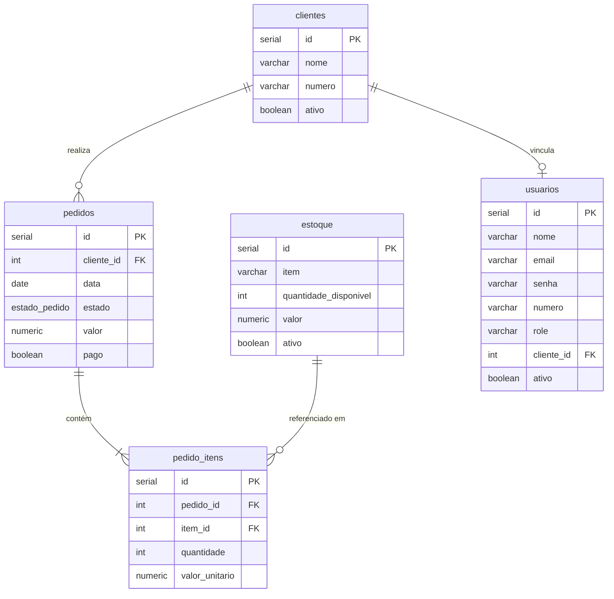
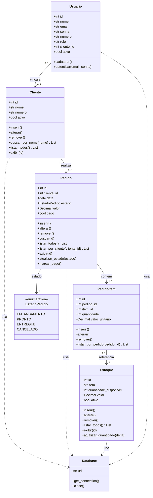

# Sistema de Marmitaria - Projeto de Banco de Dados

Este projeto foi desenvolvido para a disciplina de Banco de Dados e tem como objetivo implementar um sistema CRUD completo para o gerenciamento de uma marmitaria.

A aplicação simula o funcionamento de um sistema de vendas simples, permitindo o cadastro de clientes, marmitas e pedidos, além de consultas e geração de relatórios.

---

## Primeiros passos

O projeto usa **Dev Containers**. Ao abrir no VS Code/Cursor, o ambiente é configurado automaticamente com Python 3.12, PostgreSQL, UV, lazygit e opencode.

### 1. Abrir o container

Na paleta de comandos (`Ctrl+Shift+P` / `Cmd+Shift+P`), selecione:

```
Dev Containers: Reopen in Container
```

### 2. Configurar o GitHub (obrigatório para desenvolvimento)

Ao abrir o container, o terminal exibirá um aviso caso o GitHub ainda não esteja configurado. Execute:

```bash
gh auth login
```

Siga as instruções e escolha:
- **GitHub.com**
- **HTTPS** (recomendado) ou SSH
- **Login via browser** (mais fácil)

Após autenticar, push e pull funcionarão normalmente.

### 3. Instalar dependências

As dependências Python são instaladas automaticamente via `uv sync` na criação do container. Para instalar manualmente:

```bash
uv sync
```

Para adicionar novos pacotes:

```bash
uv add nome-do-pacote
```

### 4. Rodar os testes

```bash
# Todos os testes
uv run pytest tests/ -v

# Um arquivo específico
uv run pytest tests/test_cliente_repository.py -v

# Um teste específico
uv run pytest tests/test_pedido_repository.py::test_inserir_calcula_valor_total -v
```

---

## Banco de Dados

### Diagrama Entidade-Relacionamento



### Tabelas

#### `clientes`
| Coluna | Tipo | Restrições |
|--------|------|------------|
| id | `SERIAL` | `PRIMARY KEY` |
| nome | `VARCHAR(255)` | `NOT NULL` |
| numero | `VARCHAR(20)` | `NOT NULL` |
| ativo | `BOOLEAN` | `NOT NULL`, default `true` (remoção lógica) |

**Índice:** `idx_clientes_nome` em `nome` — para busca por nome.

---

#### `estoque`
Cardápio de itens disponíveis na loja (Yao).

| Coluna | Tipo | Restrições |
|--------|------|------------|
| id | `SERIAL` | `PRIMARY KEY` |
| item | `VARCHAR(255)` | `NOT NULL` |
| quantidade_disponivel | `INT` | `NOT NULL`, `>= 0` |
| valor | `NUMERIC(10,2)` | `NOT NULL`, `> 0` |
| ativo | `BOOLEAN` | `NOT NULL`, default `true` (remoção lógica) |

---

#### `pedidos`
| Coluna | Tipo | Restrições |
|--------|------|------------|
| id | `SERIAL` | `PRIMARY KEY` |
| cliente_id | `INT` | `NOT NULL`, `FK → clientes(id)` |
| data | `DATE` | `NOT NULL`, default `CURRENT_DATE` |
| estado | `estado_pedido` | `NOT NULL`, default `'EM_ANDAMENTO'` |
| valor | `NUMERIC(10,2)` | `NOT NULL`, default `0` |
| pago | `BOOLEAN` | `NOT NULL`, default `false` |

**Tipo ENUM `estado_pedido`:** `EM_ANDAMENTO` → `PRONTO` → `ENTREGUE`

**Índices:** `idx_pedidos_cliente_id`, `idx_pedidos_estado`

---

#### `pedido_itens`
Tabela de junção entre `pedidos` e `estoque` (relação N:N).
Cada linha representa um item dentro de um pedido.

| Coluna | Tipo | Restrições |
|--------|------|------------|
| id | `SERIAL` | `PRIMARY KEY` |
| pedido_id | `INT` | `NOT NULL`, `FK → pedidos(id) ON DELETE CASCADE` |
| item_id | `INT` | `NOT NULL`, `FK → estoque(id)` |
| quantidade | `INT` | `NOT NULL`, `> 0`, default `1` |
| valor_unitario | `NUMERIC(10,2)` | `NOT NULL`, `> 0` |

**Índices:** `idx_pedido_itens_pedido`, `idx_pedido_itens_item`

**Restrição adicional:** `UNIQUE (pedido_id, item_id)` para impedir o mesmo item duplicado no mesmo pedido.

> O `ON DELETE CASCADE` garante que ao remover um pedido, todos os seus itens são removidos automaticamente.

---

#### `usuarios`
Tabela de autenticação e autorização da aplicação.

| Coluna | Tipo | Restrições |
|--------|------|------------|
| id | `SERIAL` | `PRIMARY KEY` |
| nome | `VARCHAR(255)` | `NOT NULL` |
| email | `VARCHAR(255)` | `NOT NULL`, `UNIQUE` |
| senha | `VARCHAR(255)` | `NOT NULL` |
| numero | `VARCHAR(20)` | `NOT NULL` |
| role | `VARCHAR(20)` | `NOT NULL`, default `'user'`, `CHECK (role IN ('admin', 'user'))` |
| cliente_id | `INT` | `NULL`, `FK → clientes(id)` |
| ativo | `BOOLEAN` | `NOT NULL`, default `true` |

**Índices:** `idx_usuarios_email`, `idx_usuarios_email_unique`

**Seed padrão:** usuário admin `yao@lanches.com`

---

### Regras de negócio no banco

| Regra | Implementação |
|-------|--------------|
| Estoque nunca negativo | `CHECK (quantidade_disponivel >= 0)` |
| Valor do item sempre positivo | `CHECK (valor > 0)` |
| Quantidade de item no pedido > 0 | `CHECK (quantidade > 0)` |
| Valor unitário do item no pedido > 0 | `CHECK (valor_unitario > 0)` |
| Estado do pedido restrito | `ENUM` com valores fixos |
| Papel do usuário restrito | `CHECK (role IN ('admin', 'user'))` |
| Pedido sempre vinculado a um cliente | `NOT NULL REFERENCES clientes(id)` |
| Itens orfãos removidos com o pedido | `ON DELETE CASCADE` em `pedido_itens` |
| E-mail de usuário único | `UNIQUE` em `usuarios.email` |

---

## Modelagem — Diagrama UML de Classes



**Regra de negócio (remoção lógica de Cliente):** clientes não são removidos fisicamente do banco. Quando o cliente **não possui pedidos vinculados**, o método `remover()` deve **inativar** o cliente (ex.: `ativo = false`) para preservar o histórico e permitir reativação futura. Quando o cliente **possui pedidos vinculados**, o método `remover()` deve lançar uma exceção e **não** permitir a remoção/inativação, garantindo a preservação do histórico de pedidos e relatórios. Métodos de listagem devem considerar apenas clientes ativos.

**Regra de negócio (remoção lógica de Estoque):** itens de estoque também não são removidos fisicamente. O método `remover()` de Estoque deve **inativar** o item (ex.: `ativo = false`) para preservar a integridade referencial com `pedido_itens.item_id` e o histórico de vendas. Métodos de listagem devem considerar apenas itens ativos.

### Descrição das entidades

| Entidade | Tabela | Descrição |
|---|---|---|
| `Cliente` | `clientes` | Cadastro de clientes da marmitaria (remoção lógica via campo `ativo`) |
| `Pedido` | `pedidos` | Pedidos realizados pelos clientes |
| `PedidoItem` | `pedido_itens` | Itens de cada pedido (N:N entre pedidos e estoque), com quantidade e valor unitário congelado no momento da compra |
| `Estoque` | `estoque` | Cardápio de itens disponíveis com preço e quantidade (Yao) |
| `Usuario` | `usuarios` | Usuários de autenticação, com papel `admin` ou `user` e vínculo opcional com `Cliente` |
| `EstadoPedido` | — | Enum: `EM_ANDAMENTO`, `PRONTO`, `ENTREGUE`, `CANCELADO` |
| `Database` | — | Gerencia a conexão com o PostgreSQL |