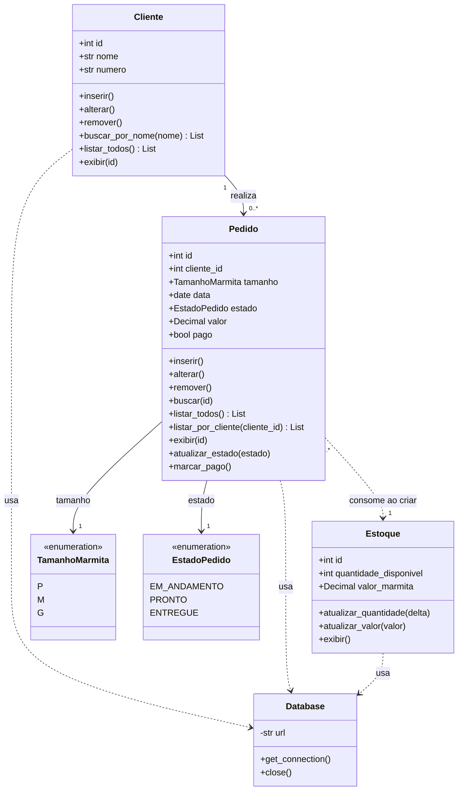

# Sistema de Marmitaria - Projeto de Banco de Dados

Este projeto foi desenvolvido para a disciplina de Banco de Dados e tem como objetivo implementar um sistema CRUD completo para o gerenciamento de uma marmitaria.

A aplicação simula o funcionamento de um sistema de vendas simples, permitindo o cadastro de clientes, marmitas e pedidos, além de consultas e geração de relatórios.

---

## Primeiros passos

O projeto usa **Dev Containers**. Ao abrir no VS Code/Cursor, o ambiente é configurado automaticamente com Python 3.12, PostgreSQL, UV, lazygit e opencode.

### 1. Abrir o container

Na paleta de comandos (`Ctrl+Shift+P` / `Cmd+Shift+P`), selecione:

```
Dev Containers: Reopen in Container
```

### 2. Configurar o GitHub (obrigatório para desenvolvimento)

Ao abrir o container, o terminal exibirá um aviso caso o GitHub ainda não esteja configurado. Execute:

```bash
gh auth login
```

Siga as instruções e escolha:
- **GitHub.com**
- **HTTPS** (recomendado) ou SSH
- **Login via browser** (mais fácil)

Após autenticar, push e pull funcionarão normalmente.

### 3. Instalar dependências

As dependências Python são instaladas automaticamente via `uv sync` na criação do container. Para instalar manualmente:

```bash
uv sync
```

Para adicionar novos pacotes:

```bash
uv add nome-do-pacote
```

---

## Modelagem — Diagrama UML de Classes



### Descrição das entidades

| Entidade | Tabela | Descrição |
|---|---|---|
| `Cliente` | `clientes` | Cadastro de clientes da marmitaria |
| `Pedido` | `pedidos` | Pedidos realizados pelos clientes |
| `Estoque` | `estoque` | Controle de marmitas disponíveis e preço (Yao) |
| `TamanhoMarmita` | — | Enum: `P`, `M`, `G` |
| `EstadoPedido` | — | Enum: `EM_ANDAMENTO`, `PRONTO`, `ENTREGUE` |
| `Database` | — | Gerencia a conexão com o PostgreSQL |
